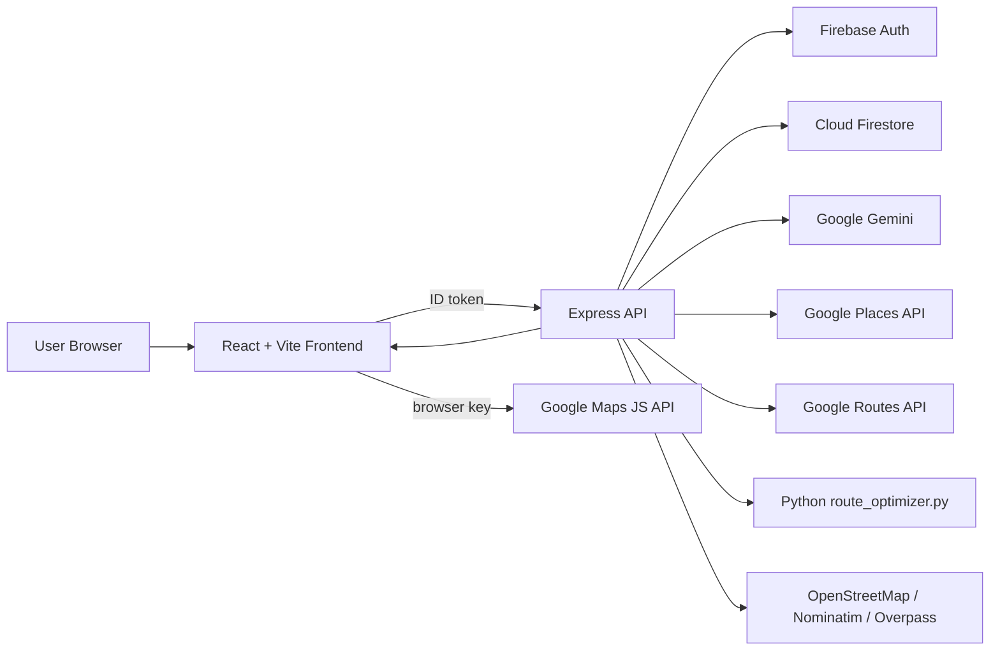

# Technical Audit And System Documentation

Audit date: 2026-04-01  
Repository: `AI-Travel-Planner`

## 1. Project Overview

This project is a full-stack travel planning system built around four main capabilities:

1. User-authenticated trip generation with Gemini.
2. Persistence of generated trips in Cloud Firestore.
3. Destination enrichment through hotel, restaurant, and route services.
4. Interactive day-wise map visualization with optimized route sequencing.

The system is organized as a Vite + React frontend in [`Travel Planner/`](./Travel%20Planner), a Node/Express backend in [`Travel Planner/server/`](./Travel%20Planner/server), shared normalization logic in [`Travel Planner/shared/`](./Travel%20Planner/shared), a Python route optimizer in [`route_optimizer.py`](./route_optimizer.py), and a Vercel serverless entrypoint in [`api/[...all].js`](./api/%5B...all%5D.js).

## 2. Audit Scope And Method

The audit covered:

- Frontend routing, state handling, map rendering, and destination detail flows.
- Backend API routes, auth, rate limiting, trip generation, recommendation loading, route optimization, and caching.
- Shared schema and normalization logic.
- Python optimization logic.
- Deployment/configuration files (`vercel.json`, `.env.example`, `package.json`).
- Firestore persistence shape and ownership model.
- Automated validation via:
  - `npm test`
  - `npm run lint`
  - `npm run build`

Live browser-driven E2E and real external API execution were not part of this audit because the repository does not include a browser automation harness and external API behavior depends on environment credentials and billing-enabled Google services.

## 3. System Architecture

### 3.1 Frontend

Primary frontend modules:

- [`src/create-trip/index.jsx`](./Travel%20Planner/src/create-trip/index.jsx): trip request form, objective and constraint input, authenticated submission.
- [`src/view-trip/index.jsx`](./Travel%20Planner/src/view-trip/index.jsx): trip detail orchestration, recommendations, optimized routes, alternatives, replanning.
- [`src/view-trip/components/OptimizedRouteSection.jsx`](./Travel%20Planner/src/view-trip/components/OptimizedRouteSection.jsx): day selector, route detail cards, synchronized map-side itinerary.
- [`src/view-trip/components/TripDayMap.jsx`](./Travel%20Planner/src/view-trip/components/TripDayMap.jsx): Google Maps-based shared map, marker highlighting, day-level route rendering.
- [`src/lib/api.js`](./Travel%20Planner/src/lib/api.js): authenticated API wrapper.
- [`src/lib/tripRoutes.js`](./Travel%20Planner/src/lib/tripRoutes.js) and [`src/lib/tripRecommendations.js`](./Travel%20Planner/src/lib/tripRecommendations.js): frontend caching for on-demand route/recommendation fetches.
- [`src/context/AuthContext.jsx`](./Travel%20Planner/src/context/AuthContext.jsx): Firebase Auth session management.

### 3.2 Backend

Primary backend modules:

- [`server/app.js`](./Travel%20Planner/server/app.js): Express app, security headers, CORS, JSON parsing, error handling.
- [`server/routes/trips.js`](./Travel%20Planner/server/routes/trips.js): authenticated REST API surface.
- [`server/services/gemini.js`](./Travel%20Planner/server/services/gemini.js): planner-critic-repair trip generation flow.
- [`server/services/trips.js`](./Travel%20Planner/server/services/trips.js): Firestore persistence, ownership checks, replanning.
- [`server/services/recommendations.js`](./Travel%20Planner/server/services/recommendations.js): hotel/restaurant retrieval with Google Places, OpenStreetMap, and mock fallback layers.
- [`server/services/routeOptimization.js`](./Travel%20Planner/server/services/routeOptimization.js): city-scoped geocoding, distance matrix construction, optimization, and route response generation.
- [`server/services/cacheStore.js`](./Travel%20Planner/server/services/cacheStore.js): memory and optional Redis-backed stale cache abstraction.
- [`server/middleware/auth.js`](./Travel%20Planner/server/middleware/auth.js): Firebase ID token verification.
- [`server/middleware/rateLimit.js`](./Travel%20Planner/server/middleware/rateLimit.js): trip generation and replanning throttling.

### 3.3 Shared Domain Layer

The shared schema layer standardizes the system contract:

- [`shared/trips.js`](./Travel%20Planner/shared/trips.js): request normalization, AI response normalization, trip persistence schema, fallback generation.
- [`shared/maps.js`](./Travel%20Planner/shared/maps.js): coordinates, Google Maps URLs, polyline decoding, HTML-safe text escaping.
- [`shared/recommendations.js`](./Travel%20Planner/shared/recommendations.js): recommendation card normalization.
- [`shared/apiErrors.js`](./Travel%20Planner/shared/apiErrors.js): normalized API failure handling.

## 4. End-To-End Functional Flow

### 4.1 Trip Generation

1. The user fills the planner form in the frontend.
2. The frontend normalizes and validates user inputs.
3. The frontend sends `POST /api/trips/generate` with Firebase bearer auth.
4. The backend verifies the ID token.
5. [`generateTripPlan`](./Travel%20Planner/server/services/gemini.js) calls Gemini to produce a strict JSON itinerary.
6. The backend performs deterministic repair, fusion-backed critique, and fallback handling.
7. The normalized trip is persisted to Firestore in collection `AITrips`.
8. The user is redirected to `/trips/:tripId`.

### 4.2 Trip Viewing

1. The frontend loads the trip document via `GET /api/trips/:tripId`.
2. Recommendations are fetched lazily via `GET /api/trips/:tripId/recommendations`.
3. Routes are fetched lazily via `GET /api/trips/:tripId/routes`.
4. Route alternatives are fetched via `GET /api/trips/:tripId/alternatives`.
5. The route section selects a default day and synchronizes the shared map with the selected day.

### 4.3 Replanning

1. A disruption payload is posted to `POST /api/trips/:tripId/replan`.
2. The backend mutates `aiPlan` and `itinerary` day content for the affected stops.
3. Deterministic repair and constraint evaluation are reapplied.
4. The updated trip replaces the stored document.

## 5. Features Implemented

### 5.1 Core Product Features

- Google sign-in with Firebase Auth.
- Guided trip creation with:
  - destination
  - days
  - budget
  - traveler type
  - route objective
  - constraint controls
  - alternative count
- Gemini-generated day-wise itineraries.
- Saved trip listing and authenticated trip detail access.
- Recommendations for hotels and restaurants.
- City-scoped optimized daily route visualization.
- Replanning support for disruptions.
- Trip PDF generation.
- Static informational pages and polished landing page experience.

### 5.2 Mapping And Routing Features

- Day-wise route generation instead of country-level plotting.
- One shared map synchronized to the active itinerary day.
- Marker placement for resolved itinerary stops.
- Polyline rendering from Google Routes when available.
- Straight-line coordinate fallback when route preview is unavailable.
- Google Maps deep links for search and external directions.

### 5.3 Resilience Features

- Firestore ownership backfill for legacy documents.
- OpenStreetMap fallback when Google Places is unavailable.
- Curated mock fallback when live recommendation providers fail.
- Haversine route fallback when Google Routes is unavailable.
- JS route optimizer fallback when Python is disabled or fails.
- Memory cache with stale-serving semantics.

## 6. Recently Implemented Changes

Based on the recent Git history, the most recent system additions fall into four categories.

### 6.1 UI Changes

- Interactive shared city map for route visualization.
- Day-based route navigation in the trip detail view.
- Marker-hover and segment highlighting.
- Split itinerary/map layout in the route section.

### 6.2 Backend Changes

- City-bound route geocoding and filtering.
- Fallback stop discovery using Google Places when itinerary days have too few stops.
- Route alternatives and multi-objective ranking.
- Adaptive rate limiting for replanning.
- Replanning simulator integrated into trip detail flows.

### 6.3 Algorithmic Additions

- Python route optimizer using Dijkstra, Prim, nearest-neighbor, and 2-opt.
- Objective-specific weight matrices for:
  - fastest
  - cheapest
  - best_experience
- Source-confidence fusion and deterministic constraint repair.

### 6.4 Platform And Performance Changes

- Production bundle chunk splitting in Vite.
- Root-level Vercel deployment normalization.
- Research evaluation script exposed as `npm run eval:research`.

## 7. Algorithmic Design

## 7.1 Graph Model

For each day, the route system constructs a weighted directed graph:

- `G = (V, E)`
- Each stop `v_i ∈ V` is a node.
- Each directed pair `(v_i, v_j) ∈ E` is assigned:
  - `distanceMeters(i, j)`
  - `durationSeconds(i, j)`

These weights are sourced from Google Routes `computeRouteMatrix` when available, or derived from the haversine fallback otherwise.

The route matrix may be viewed as:

`W[i][j] = w(v_i, v_j)`

where `w` is either duration-based or distance-based depending on the chosen objective profile.

## 7.2 Dijkstra Shortest Paths

The Python module computes shortest path distances from the origin using Dijkstra’s algorithm:

`d(s) = 0`

`d(v) = min(d(u) + w(u, v))`

for all reachable `v`, where `u` is a predecessor already settled by the algorithm.

Implementation:

- Python heap-based priority queue in [`route_optimizer.py`](./route_optimizer.py).
- JS matrix-based variant in [`routeOptimization.js`](./Travel%20Planner/server/services/routeOptimization.js) for fallback and analytics.

Use in this project:

- Provides shortest-path diagnostics from the first stop.
- Exposed as `shortestPathsFromStart` in the route response.

## 7.3 Prim Minimum Spanning Tree

Prim’s algorithm is also computed:

`e* = argmin_{u ∈ S, v ∉ S} w(u, v)`

where `S` is the set of already connected vertices.

Use in this project:

- Analytical/diagnostic output for route structure.
- Not used directly as the visit order because MST does not produce a valid ordered tour.

## 7.4 Ordered Route Optimization

The visit order is produced heuristically:

1. Nearest-neighbor initialization:

`v_{k+1} = argmin_{u ∈ U} w(v_k, u)`

where `U` is the set of unvisited nodes.

2. 2-opt local improvement:

Given a path `π`, perform segment reversal if:

`L(π') < L(π)`

where:

`L(π) = Σ w(π_i, π_{i+1})`

This is appropriate here because the number of daily stops is intentionally capped (`ROUTE_OPTIMIZER_MAX_STOPS_PER_DAY`, default `8`), making heuristic optimization fast and practical.

## 7.5 Objective Weighting

The project supports three optimization objectives:

- `fastest`
- `cheapest`
- `best_experience`

Edge weights are adjusted differently per profile.

### Fastest

`w_fastest(i, j) = durationSeconds(i, j) * timePenalty`

### Cheapest

`baseTravelCost = (distanceKm * 4.5 * budgetIntensity)`

`w_cheapest(i, j) = 45 * baseTravelCost + 0.18 * durationSeconds(i, j) * timePenalty`

### Best Experience

`experienceBonus = avg(score_i, score_j)`

`w_experience(i, j) = max(1, 0.55 * durationSeconds(i, j) * timePenalty + 16 * baseTravelCost - 40 * experienceBonus)`

The final candidate routes are then ranked by a Pareto-style objective score:

- Fastest:
  - `score = 0.7 * (1 - durationRatio) + 0.2 * (1 - costRatio) + 0.1 * experienceRatio`
- Cheapest:
  - `score = 0.65 * (1 - costRatio) + 0.35 * (1 - durationRatio)`
- Best experience:
  - `score = 0.6 * experienceRatio + 0.25 * (1 - durationRatio) + 0.15 * (1 - costRatio)`

## 7.6 Haversine Fallback

When live route data is unavailable, the system estimates pairwise distances via the haversine formula:

`a = sin²(Δφ/2) + cos(φ1) cos(φ2) sin²(Δλ/2)`

`d = 2R atan2(√a, √(1-a))`

where:

- `φ` is latitude in radians
- `λ` is longitude in radians
- `R = 6,371,000 m`

Travel duration is then approximated using:

`duration ≈ distance / fallbackSpeed`

## 7.7 Constraint Evaluation

Constraint analysis operates at the itinerary level.

For each day:

`dayMinutes = Σ estimateActivityMinutes(a_i) + 25 * (n - 1)`

Hard violations are raised when:

- day count differs from requested days
- daily time budget is exceeded
- budget cap is violated
- day numbering is invalid
- activity count falls outside `3..5`

Soft violations cover:

- generic placeholder activities
- low-confidence or weakly supported activities
- repeated activities across days

## 7.8 Source Fusion

The data-fusion layer combines itinerary, AI, Google Places, OSM, and recommendation sources.

Confidence is merged using:

`c_merge = 1 - (1 - c_left)(1 - c_right)`

This acts like probabilistic confidence accumulation and avoids simple overwriting.

## 8. Complexity Summary

With the day-stop cap `n ≤ 8`, the implemented algorithms are computationally safe for request-time execution.

- Dijkstra (Python heap implementation): `O((V + E) log V)`
- Prim (matrix scan): `O(V²)`
- Nearest-neighbor initialization: `O(V²)`
- 2-opt local improvement: worst case `O(V³)` on small `V`
- Geocoding per stop: network-bound
- Google Routes matrix: network-bound

The dominant latency in practice is not CPU time but external API I/O.

## 9. Database Design

## 9.1 Database Type

The system uses **Cloud Firestore** (NoSQL document database) through the Firebase Admin SDK on the backend.

Authentication uses **Firebase Authentication**, but trip persistence uses Firestore only.

## 9.2 Collection Model

Primary collection:

- `AITrips`

Each document represents one generated trip.

## 9.3 Trip Document Schema

| Field | Type | Source | Notes |
| --- | --- | --- | --- |
| `id` | string | server | UUID trip identifier |
| `ownerId` | string | auth | Firebase UID |
| `ownerEmail` | string | auth | User email for legacy compatibility |
| `createdAt` | ISO string | server | Creation timestamp |
| `updatedAt` | ISO string | server | Last update timestamp |
| `userSelection` | object | shared schema | Normalized planner inputs |
| `hotels` | array | Gemini/shared | Normalized hotel list |
| `itinerary.days[]` | array | shared schema | Day-wise places for UI consumption |
| `aiPlan.destination` | string | Gemini/shared | Canonical destination |
| `aiPlan.days[]` | array | Gemini/shared | Day-wise activity plans |
| `aiPlan.totalEstimatedCost` | string | Gemini/shared | Cost band summary |
| `aiPlan.travelTips[]` | array | Gemini/shared | Trip-level tips |
| `llmArtifacts` | object | backend | Raw/derived planner-critic-repair artifacts |
| `optimizationMeta` | object | backend | Objective, constraints, method, generation metadata |
| `constraintReport` | object | backend | Hard/soft validation result |
| `sourceProvenance` | object | backend | Source providers and cache metadata |
| `latencyBreakdownMs` | object | backend | Planner, critic, repair, fusion, persist timings |
| `routeAlternatives` | array | backend | Stored route alternative summaries when present |

## 9.4 Relationships

Logical relationships:

- One authenticated user → many trips.
- One trip → many itinerary days.
- One itinerary day → many places/activities.

Recommendations and route responses are **not persisted** in Firestore by default. They are computed lazily and cached in process memory or optional Redis-compatible cache layers.

## 9.5 Access Model

Ownership checks are enforced server-side:

- document access requires a valid Firebase ID token
- read/list access only returns documents owned by the requesting UID/email
- legacy trips without `ownerId` are backfilled on access

## 10. API Integrations

## 10.1 Gemini

Used for itinerary generation and critic/repair passes.

Relevant configuration:

- `GOOGLE_GEMINI_API_KEY`
- `GEMINI_MODEL`
- `GEMINI_TIMEOUT_MS`
- `GEMINI_MAX_RETRIES`

## 10.2 Google Places API

Used for:

- text search geocoding of itinerary places
- destination recommendations
- city viewport resolution
- photo/media enrichment for recommendation cards

Relevant configuration:

- `GOOGLE_PLACES_API_KEY`

## 10.3 Google Routes API

Used for:

- `computeRouteMatrix`
- `computeRoutes`

Relevant configuration:

- `GOOGLE_MAPS_API_KEY`

## 10.4 Google Maps JavaScript API

Used in the browser for:

- interactive day-wise map rendering
- markers
- route polylines
- info windows
- bounds restriction to the destination city

Relevant configuration:

- `VITE_GOOGLE_MAPS_BROWSER_KEY`

## 10.5 OpenStreetMap / Nominatim / Overpass

Used as fallback for recommendation retrieval when Google Places is unavailable or fails.

## 10.6 Firebase

Used for:

- client sign-in
- backend token verification
- trip persistence

Relevant configuration:

- `VITE_FIREBASE_*`
- `FIREBASE_PROJECT_ID`
- `FIREBASE_CLIENT_EMAIL`
- `FIREBASE_PRIVATE_KEY`

## 11. Performance And Optimization Notes

Current optimization measures:

- Frontend caches recommendations and route responses for five minutes.
- Backend recommendation and route services support fresh/stale caching.
- Vite uses manual chunk splitting to reduce initial bundle pressure.
- Daily stop count is capped to keep route optimization bounded.
- Places/Routes calls time out rather than hanging indefinitely.

Observed build profile:

- main app chunk is now split into vendor/domain-specific chunks
- PDF generation remains the heaviest lazy-worthy dependency block

## 12. Issues Found

## 12.1 Validation Hardening During This Audit

1. **Map info-window escaping regression coverage**
   - The shared map layer already escaped info-window content through `escapeHtmlText`.
   - This audit added explicit regression coverage in [`tests/shared/maps.test.js`](./Travel%20Planner/tests/shared/maps.test.js) to ensure HTML-significant characters remain neutralized in future changes.

## 12.2 Remaining Non-Blocking Issues

1. **Unused orchestration module**
   - [`server/services/orchestration.js`](./Travel%20Planner/server/services/orchestration.js) is currently not referenced by runtime code.
   - Impact: duplicate planner-critic-repair logic and architectural drift risk because [`server/services/gemini.js`](./Travel%20Planner/server/services/gemini.js) already implements the active path.

2. **Redis cache path is optional but not provisioned by default**
   - The cache abstraction supports Redis, but the system falls back to memory when the `redis` package or `REDIS_URL` is unavailable.
   - Impact: production caching is process-local unless Redis is explicitly installed and configured.

3. **No browser automation harness**
   - The repo does not include Playwright/Cypress browser tests for:
     - Google Maps rendering
     - hover synchronization
     - live replan UX
   - Impact: UI interaction correctness is validated indirectly through build/tests, not through browser E2E.

4. **Python optimizer is not suitable for typical Vercel serverless runtime**
   - The deployment is Node-first. The Python optimizer works locally or in environments with Python available, but Vercel serverless deployment should rely on the JS fallback unless Python is moved into a separate service/runtime.

5. **Firestore rules are not versioned in this repo**
   - Backend access control is enforced correctly in the API, but infrastructure-level Firestore rules are not included alongside application code.

## 13. Improvements Suggested

1. Consolidate planner-critic-repair flow into a single service path.
2. Add Playwright-based browser smoke tests for:
   - create trip
   - trip detail loading
   - day switching on the shared map
   - recommendation retry flows
3. Parallelize per-stop geocoding inside route optimization to reduce latency under larger stop sets.
4. Persist geocode and route cache entries in Redis or another shared cache for multi-instance deployments.
5. Consider storing stable Google Place IDs in normalized itinerary items once resolved to reduce repeated text-search lookups.
6. Lazy-load or isolate the PDF toolchain further if first-load bundle pressure becomes a concern.
7. Add Firestore rules and deployment infrastructure docs to the repo for full production reproducibility.

## 14. Validation Status

The following checks were executed successfully during this audit:

- `npm test`
- `npm run lint`
- `npm run build`

Observed result summary:

- Full automated suite passed.
- HTTP-binding server tests remain intentionally skipped in the sandbox.
- No ESLint errors remained after the security fix and repo-wide cleanup.
- Production build succeeded with chunk splitting in place.

## 15. Final System Status

### Overall Assessment

The project is **functionally coherent and presentation-ready** provided the required environment variables and Google/Firebase services are configured correctly.

### What Is Working Correctly

- Authenticated trip generation and persistence flow.
- Firestore-backed trip ownership and retrieval.
- Lazy recommendation loading with live/fallback providers.
- City-scoped route computation with marker generation.
- Interactive day-synced shared map UI.
- Route alternatives and replanning.
- Shared schema normalization and validation.
- Build, lint, and automated test workflows.

### What Still Requires Environment Support

- Firebase Auth and Firestore credentials.
- Gemini key and quota.
- Google Places / Routes / Maps keys and billing.
- Python runtime only if Python route optimization is explicitly enabled.

### Readiness Verdict

**Ready for demo, submission, and technical presentation.**  
The system is in a good state for evaluation, with remaining concerns limited to deployment/runtime constraints and a small amount of architectural cleanup rather than core functionality failure.
